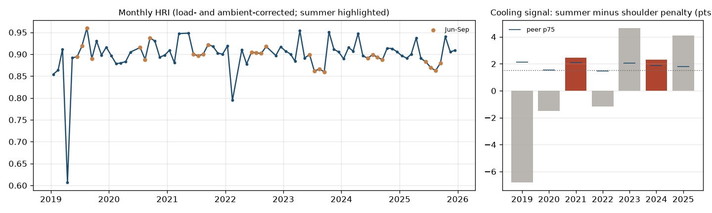

# Ravenswood (CC) - balance-of-plant evidence brief

**Customer:** LS Power Group (prospect) · **State / BA:** NY / NYIS · **Capacity:** 268 MW · **Original COD:** 2003 (BoP age 22 yrs)

**Tier: CONFIRMED** · BPRI 67 / 100 · confidence **high**

## What the data shows
- **Summer heat-rate penalty surviving ambient correction:** recent cooling signal 3.69 points (summer minus shoulder), trend +1.52 pts/yr; flagged in 2 year(s).
- **Unexplained / intermittent deficit:** C2 percentile 85 (share of the HRI deficit not explained by fouling, hot-gas-path, duct firing or fuel quality).

| Year | Cooling signal (pts) | Peer p75 (pts) | Flagged |
|---|---|---|---|
| 2019 | -6.81 | 2.13 | no |
| 2020 | -1.51 | 1.55 | no |
| 2021 | 2.45 | 2.07 | yes |
| 2022 | -1.18 | 1.46 | no |
| 2023 | 4.66 | 2.04 | no |
| 2024 | 2.29 | 1.86 | yes |
| 2025 | 4.11 | 1.80 | no |

## Peer comparison and exposure profile
Percentiles vs peers (same class, unit-size band, climate region):
C1 cooling 99 · C2 unattributed/BoP 85 · C3 cycling 25 (CEMS) · C4 trips 36 · C5 ramping 28 · C6 BoP age 36 · C7 interruptible gas 81.
Starts/MW/yr 0.03 · trip rate 0.95 per 1,000 h · cold-start share 17%.

**Indicative recoverable fuel cost (cooling + BoP signatures, last 24 months annualised):** $41,863/yr - an UNVALIDATED placeholder recovery fraction applied to fuel priced at the plant's gas cost; not a quote.

## Suggested scope
Condenser performance test + circulating-water flow verification + circ-water pump vibration survey. The circulating-water pump vibration survey should read 1x / 2x / broadband / vane-pass-frequency signatures.

## What this brief does not claim
- The index detects a **system-level thermodynamic consequence** (a summer heat-rate penalty that survives ambient correction, consistent with condenser or cooling-water degradation), **not a component fault**. It never identifies a pump or bearing.
- Detection floor: **4.5% heat-rate change in a single month, 1.30% sustained over 12 months** (month-over-month noise sigma = 2.25% on stable baseload CC). Total failure of the largest auxiliary pump on a 500 MW plant is about 1.2% of output, so individual pumps sit below the floor by construction.
- Confirming a cause requires **on-site work**: a condenser performance test and a pump vibration survey.
