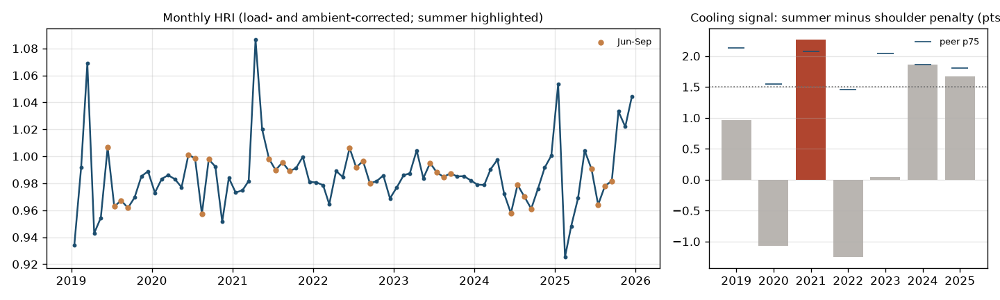

# Dynegy Moss Landing Power Plant Hybrid (CC) - balance-of-plant evidence brief

**Customer:** Vistra Group (prospect) · **State / BA:** CA / CISO · **Capacity:** 1,398 MW · **Original COD:** 2002 (BoP age 23 yrs)

**Tier: CONFIRMED** · BPRI 83 / 100 · confidence **high**

## What the data shows
- **Summer heat-rate penalty surviving ambient correction:** recent cooling signal 1.19 points (summer minus shoulder), trend +0.21 pts/yr; flagged in 1 year(s).
- **Unexplained / intermittent deficit:** C2 percentile 75 (share of the HRI deficit not explained by fouling, hot-gas-path, duct firing or fuel quality).

| Year | Cooling signal (pts) | Peer p75 (pts) | Flagged |
|---|---|---|---|
| 2019 | 0.96 | 2.13 | no |
| 2020 | -1.07 | 1.55 | no |
| 2021 | 2.27 | 2.07 | yes |
| 2022 | -1.25 | 1.46 | no |
| 2023 | 0.04 | 2.04 | no |
| 2024 | 1.86 | 1.86 | no |
| 2025 | 1.67 | 1.80 | no |

## Peer comparison and exposure profile
Percentiles vs peers (same class, unit-size band, climate region):
C1 cooling 81 · C2 unattributed/BoP 75 · C3 cycling 100 (CEMS) · C4 trips 92 · C5 ramping 100 · C6 BoP age 85 · C7 interruptible gas 33.
Starts/MW/yr 0.51 · trip rate 13.99 per 1,000 h · cold-start share 7%.

**Indicative recoverable fuel cost:** none attributed in the last 24 months - recent summer months are already explained by compressor fouling or duct firing, or the cooling signal is below the flag threshold. The tier rests on the multi-year evidence above.

## Suggested scope
Condenser performance test + circulating-water flow verification + circ-water pump vibration survey. The circulating-water pump vibration survey should read 1x / 2x / broadband / vane-pass-frequency signatures.

## What this brief does not claim
- The index detects a **system-level thermodynamic consequence** (a summer heat-rate penalty that survives ambient correction, consistent with condenser or cooling-water degradation), **not a component fault**. It never identifies a pump or bearing.
- Detection floor: **4.5% heat-rate change in a single month, 1.30% sustained over 12 months** (month-over-month noise sigma = 2.25% on stable baseload CC). Total failure of the largest auxiliary pump on a 500 MW plant is about 1.2% of output, so individual pumps sit below the floor by construction.
- Confirming a cause requires **on-site work**: a condenser performance test and a pump vibration survey.
