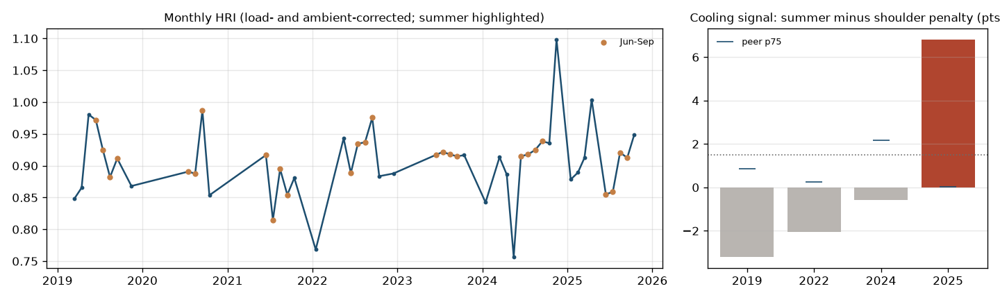

# Riverside (OK) (ST) - balance-of-plant evidence brief

**Customer:** American Electric Power Company, Inc. (SSI customer) · **State / BA:** OK / SWPP · **Capacity:** 946 MW · **Original COD:** 1974 (BoP age 51 yrs)

**Tier: CONFIRMED** · BPRI 69 / 100 · confidence **high**

## What the data shows
- **Summer heat-rate penalty surviving ambient correction:** recent cooling signal 3.11 points (summer minus shoulder), trend +1.35 pts/yr; flagged in 1 year(s).
- **Unexplained / intermittent deficit:** C2 percentile 91 (share of the HRI deficit not explained by fouling, hot-gas-path, duct firing or fuel quality).

| Year | Cooling signal (pts) | Peer p75 (pts) | Flagged |
|---|---|---|---|
| 2019 | -3.21 | 0.84 | no |
| 2022 | -2.05 | 0.24 | no |
| 2024 | -0.59 | 2.16 | no |
| 2025 | 6.81 | 0.04 | yes |

## Peer comparison and exposure profile
Percentiles vs peers (same class, unit-size band, climate region):
C1 cooling 100 · C2 unattributed/BoP 91 · C3 cycling 14 (CEMS) · C4 trips 78 · C5 ramping 17 · C6 BoP age 26 · C7 interruptible gas 56.
Starts/MW/yr 0.00 · trip rate 1.79 per 1,000 h · cold-start share n/a.

**Indicative recoverable fuel cost (cooling + BoP signatures, last 24 months annualised):** $421,935/yr - an UNVALIDATED placeholder recovery fraction applied to fuel priced at the plant's gas cost; not a quote.

## Suggested scope
Condenser performance test + circulating-water flow verification + circ-water pump vibration survey. The circulating-water pump vibration survey should read 1x / 2x / broadband / vane-pass-frequency signatures.

## What this brief does not claim
- The index detects a **system-level thermodynamic consequence** (a summer heat-rate penalty that survives ambient correction, consistent with condenser or cooling-water degradation), **not a component fault**. It never identifies a pump or bearing.
- Detection floor: **4.5% heat-rate change in a single month, 1.30% sustained over 12 months** (month-over-month noise sigma = 2.25% on stable baseload CC). Total failure of the largest auxiliary pump on a 500 MW plant is about 1.2% of output, so individual pumps sit below the floor by construction.
- Confirming a cause requires **on-site work**: a condenser performance test and a pump vibration survey.
