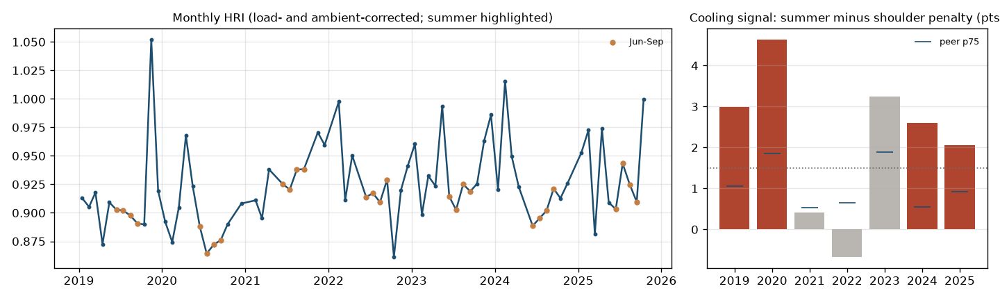

# Desert Star Energy Center (CC) - balance-of-plant evidence brief

**Customer:** Sempra Group (prospect) · **State / BA:** NV / CISO · **Capacity:** 537 MW · **Original COD:** 2000 (BoP age 25 yrs)

**Tier: CONFIRMED** · BPRI 76 / 100 · confidence **high**

## What the data shows
- **Summer heat-rate penalty surviving ambient correction:** recent cooling signal 2.64 points (summer minus shoulder), trend -0.14 pts/yr; flagged in 4 year(s).
- **Unexplained / intermittent deficit:** C2 percentile 85 (share of the HRI deficit not explained by fouling, hot-gas-path, duct firing or fuel quality).

| Year | Cooling signal (pts) | Peer p75 (pts) | Flagged |
|---|---|---|---|
| 2019 | 3.00 | 1.05 | yes |
| 2020 | 4.64 | 1.85 | yes |
| 2021 | 0.41 | 0.53 | no |
| 2022 | -0.67 | 0.66 | no |
| 2023 | 3.25 | 1.88 | no |
| 2024 | 2.60 | 0.54 | yes |
| 2025 | 2.07 | 0.93 | yes |

## Peer comparison and exposure profile
Percentiles vs peers (same class, unit-size band, climate region):
C1 cooling 77 · C2 unattributed/BoP 85 · C3 cycling 61 (CEMS) · C4 trips 68 · C5 ramping 100 · C6 BoP age 85 · C7 interruptible gas 42.
Starts/MW/yr 0.19 · trip rate 5.72 per 1,000 h · cold-start share 15%.

**Indicative recoverable fuel cost (cooling + BoP signatures, last 24 months annualised):** $244,273/yr - an UNVALIDATED placeholder recovery fraction applied to fuel priced at the plant's gas cost; not a quote.

## Suggested scope
Condenser performance test + circulating-water flow verification + circ-water pump vibration survey. The circulating-water pump vibration survey should read 1x / 2x / broadband / vane-pass-frequency signatures.

## What this brief does not claim
- The index detects a **system-level thermodynamic consequence** (a summer heat-rate penalty that survives ambient correction, consistent with condenser or cooling-water degradation), **not a component fault**. It never identifies a pump or bearing.
- Detection floor: **4.5% heat-rate change in a single month, 1.30% sustained over 12 months** (month-over-month noise sigma = 2.25% on stable baseload CC). Total failure of the largest auxiliary pump on a 500 MW plant is about 1.2% of output, so individual pumps sit below the floor by construction.
- Confirming a cause requires **on-site work**: a condenser performance test and a pump vibration survey.
